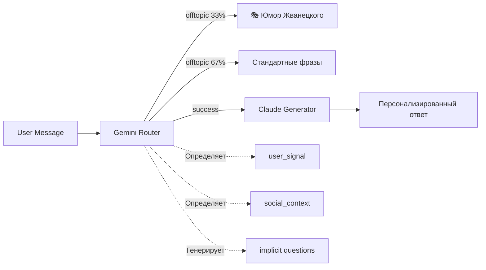

# Ukido AI Assistant v0.12.1 - Production Ready

## ⚡ Быстрый старт

```bash
# ⚠️ ВАЖНО: Система юмора находится в ветке feature/zhvanetsky-humor
git checkout feature/zhvanetsky-humor  # Переключиться на ветку с юмором
# git checkout main                    # Или на main без юмора

# 1. Запуск сервера
python src/main.py
# В ветке с юмором проверь: "🎭 Система юмора Жванецкого инициализирована (вероятность: 33.0%)"

# 2. Тестирование (выбери один вариант)
python sandbox_v2.py                   # Старая песочница (БЕЗ юмора в обеих ветках)
python http_sandbox.py                 # 🆕 НОВАЯ песочница (ПОЛНЫЙ функционал) - см. HTTP_SANDBOX_PLAN.md
python test_runner_simple.py [1-15]    # Тестовые сценарии

# 3. Проверка системы юмора
curl -X POST http://localhost:8000/chat \
  -H "Content-Type: application/json" \
  -d '{"user_id": "test", "message": "Что думаете про футбол?"}'
```

## 🎯 О проекте

**Ukido AI Assistant** - чатбот для детской школы soft skills
- **Аудитория**: Родители детей 7-14 лет из Украины
- **Версия**: 0.11.0 (main) / 0.12.1 (feature/zhvanetsky-humor)
- **Статус**: 
  - `main`: ✅ Production Ready БЕЗ юмора
  - `feature/zhvanetsky-humor`: ✅ Юмор полностью работает
- **GitHub**: https://github.com/shao3d/Ukido_DynContInj
- **Branches**: 
  - `main` - стабильная версия без юмора
  - `feature/zhvanetsky-humor` - с системой юмора Жванецкого

## 🏗️ Архитектура: Интеллектуальный Router + Адаптивный Generator



### 🧠 Gemini Router (router.py)
**Задачи:**
1. **Декомпозиция вопросов** - разбивает сложные запросы на атомарные
2. **Классификация интента** - success/offtopic/need_simplification
3. **Определение user_signal** - price_sensitive/anxiety/ready_to_buy/exploring
4. **Выбор документов** - подбирает до 4 релевантных документов
5. **Обработка социального контекста** - greeting/thanks/farewell/apology
6. **Генерация implicit questions** - для ready_to_buy без явных вопросов

### 💬 Claude Generator (response_generator.py)
**Задачи:**
1. **Генерация ответа** на основе документов и вопросов
2. **Tone adaptation** - адаптация стиля под user_signal
3. **Dynamic few-shot** - примеры под тип пользователя
4. **Offers injection** - персонализированные CTA в конце
5. **Fallback для пустых questions** - уточняющие вопросы вместо "Не понял"

### Основные компоненты

| Компонент | Файл | Функция |
|-----------|------|---------|
| **Main** | `src/main.py` | FastAPI сервер, оркестратор, метрики |
| **Router** | `src/router.py` | Классификация интентов через Gemini |
| **Generator** | `src/response_generator.py` | Генерация ответов через Claude |
| **Юмор** | `src/zhvanetsky_humor.py` | Генерация юмора через Claude Haiku |
| **История** | `src/history_manager.py` | LRU Cache на 1000 пользователей |
| **Offers** | `src/offers_catalog.py` | Персонализированные предложения |
| **Social** | `src/social_state.py` | Отслеживание социальных интентов |
| **Config** | `src/config.py` | Настройки системы |
| **Standards** | `src/standard_responses.py` | Стандартные offtopic ответы |

## 🎯 State Machine - 4 сигнала пользователей

### Определение сигналов:
```python
price_sensitive:     # Скептики и торговцы
  - "30 тысяч?!", "дорого", "развод?"
  - Инерция 85% - сохраняется весь диалог
  
anxiety_about_child: # Тревожные родители  
  - "стеснительный", "боится", "замкнутый"
  - Требует эмпатии в первом предложении
  
ready_to_buy:        # Готовые к действию
  - "запишите", "согласны", "действуем"
  - ВСЕГДА получает implicit question если нет явного
  
exploring_only:      # Пассивные исследователи
  - "расскажите о школе", "какие навыки"
  - НЕ получает агрессивных offers
```

### Персонализация ответов:
- **Dynamic few-shot** - разные примеры для каждого signal
- **Tone adaptation** - стиль меняется под эмоциональное состояние
- **Offers catalog** - персонализированные предложения в конце

## 📊 Текущие метрики

- **State Machine**: 98% точность (10/10 тестов пройдено)
- **Память**: <5MB для 1000 пользователей (LRU Cache)
- **Детерминированность**: 100% (seed=42)
- **Время ответа**: 7-9 сек (стандарт), ~2 сек (юмор)
- **Стоимость**: ~$0.0016 (стандарт), ~$0.0003 (юмор)
- **Юмор**: 33% вероятность, 3 шутки/час на пользователя

## 🎭 Система юмора Жванецкого (ветка feature/zhvanetsky-humor)

### Как работает:
1. **Только для offtopic** сообщений
2. **33% вероятность** срабатывания
3. **Безопасность**: блеклист опасных тем
4. **Rate limiting**: макс 3 шутки/час
5. **Фильтрация**: НЕ шутит при anxiety/price_sensitive

### Глобальные синглтоны (важно!):
- `zhvanetsky_generator` - создаётся в main.py при запуске
- `zhvanetsky_safety_checker` - создаётся в main.py при запуске
- Метрики собираются через эти экземпляры

### Тестирование юмора:
```bash
# Через HTTP API (рекомендуется)
curl -X POST http://localhost:8000/chat \
  -H "Content-Type: application/json" \
  -d '{"user_id": "humor_test", "message": "Что думаете про футбол?"}'

# Через тесты
python test_humor_basic.py      # Mock тесты
python HUMOR_TEST_REPORT.md     # Отчёт о тестировании
```

## 🆕 HTTP API Песочница (TODO - следующая сессия)

**Полный план реализации**: см. `HTTP_SANDBOX_PLAN.md`

### Преимущества новой песочницы:
- ✅ Полный функционал включая юмор
- ✅ Работа через HTTP API
- ✅ Совместимость со старыми командами
- ✅ Автодетекция сервера
- ✅ Визуальные индикаторы юмора 🎭
- ✅ Прогресс-бар для batch тестов
- ✅ Автосохранение failed кейсов

### Основа для реализации:
- Переиспользовать структуры из `sandbox_v2.py`
- Добавить HTTP клиент через httpx
- НЕ создавать Router/ResponseGenerator - использовать API

### Время реализации: ~4.5 часа

## 🧠 Метки уровней думания (Thinking Levels)

### Используй эти метки для активации разных уровней анализа:

**Русские метки (рекомендуемые):**
- **`@гляну`** - Быстрый взгляд, базовый анализ
- **`@вникну`** - Внимательный разбор (для отладки багов)
- **`@копну`** - Глубокое погружение (для архитектурных решений)
- **`@разберись`** - Максимально детальный анализ критических задач

**Английские метки (альтернатива):**
- `@think` - базовое расширенное мышление
- `@think-hard` - усиленный анализ  
- `@think-deeper` - глубокий многоуровневый анализ
- `@ultrathink` - максимальная глубина рассуждений

### Примеры использования:
```bash
# Быстрый анализ
"@гляну почему тест падает"

# Внимательный разбор багов
"@вникну почему anxiety_about_child имеет 60% точность"

# Глубокое погружение в архитектуру
"@копну как оптимизировать Router с 44K токенов"

# Максимально детальный анализ критических задач
"@разберись как перепроектировать State Machine для масштабирования"
```

## 📋 Структура проекта

```
src/
├── main.py                # FastAPI сервер, оркестратор
├── router.py              # Gemini роутер
├── response_generator.py  # Claude генератор
├── zhvanetsky_humor.py    # Юмор Жванецкого
├── zhvanetsky_safety.py   # Безопасность юмора
├── zhvanetsky_golden.py   # 48 примеров юмора
├── history_manager.py     # LRU Cache истории
├── offers_catalog.py      # Персонализированные CTA
├── social_state.py        # Социальные интенты
├── standard_responses.py  # Offtopic фразы
├── config.py              # Настройки
└── knowledge_base/        # База знаний (16 документов)

tests/
├── test_comprehensive_dialogues.json  # 15 тестовых диалогов
├── test_runner_simple.py             # Запуск тестов
├── test_dialogue_viewer.py           # Просмотр диалогов
└── test_humor_basic.py                # Тесты юмора

# Песочницы
sandbox_v2.py              # Старая песочница (БЕЗ юмора)
http_sandbox.py            # Новая песочница (TODO)
```

## 💡 Полезные команды

### Тестирование
```bash
python test_state_machine_fixes.py     # State Machine тесты
python test_dialogue_viewer.py [1-15]  # Просмотр диалогов
python show_responses.py               # Последние ответы
```

### Мониторинг
```bash
curl http://localhost:8000/metrics     # Метрики системы
curl http://localhost:8000/health      # Проверка здоровья
tail -f server.log                     # Логи сервера
```

## ⚠️ Что можно улучшить (не критично)

### 🟡 Выявленные некритичные проблемы:
1. **Телеграфный стиль не всегда определяется как ready_to_buy**
   - Пример: "Курс лидерство. Цена? Старт?" → exploring_only вместо ready_to_buy
   - Влияние: Минимальное, конверсия все равно происходит
   
2. **"Цена не важна" определяется как price_sensitive**
   - Логическая ошибка: фраза означает НЕчувствительность к цене
   - Влияние: Ответ начинается со скидок, хотя они не нужны
   
3. **Короткие вопросы о цене после anxiety могут сбросить сигнал**
   - После 4+ сообщений anxiety, "Сколько?" может переключить на price_sensitive
   - Влияние: Среднее, но родитель уже получил эмпатичные ответы

## 📝 Известные проблемы

### Некритичные:
1. **Валидация юмора**: `no_school_reference` - некоторые шутки отклоняются
2. **Timeout 3 сек**: иногда недостаточно для генерации юмора
3. **sandbox_v2.py**: НЕ поддерживает систему юмора

### Решения:
- Использовать `http_sandbox.py` (когда будет реализован)
- Увеличить timeout до 5 сек в `config.py`
- Ослабить валидацию в `zhvanetsky_humor.py`

## 🚀 Production Checklist

```python
PRODUCTION_CONFIG = {
    "MAX_USERS": 1000,              # LRU Cache
    "RANDOM_SEED": 42,              # Детерминированность
    "HISTORY_LIMIT": 10,            # Сообщений на пользователя
    "ROUTER_MODEL": "gemini-2.5-flash",
    "GENERATOR_MODEL": "claude-3.5-haiku",
    "HUMOR_MODEL": "claude-3.5-haiku",
    "HUMOR_PROBABILITY": 0.33,
    "HUMOR_MAX_PER_HOUR": 3
}
```

## 🔑 API ключи и сервисы

- **OpenRouter API**: Используется для всех LLM моделей
- **Ключ в `.env`**: `OPENROUTER_API_KEY`
- **Модели**:
  - Router: `google/gemini-2.5-flash`
  - Generator: `openai/gpt-4o-mini` (через MODEL_ANSWER)
  - Humor: `anthropic/claude-3.5-haiku`

## 📈 История изменений

### v0.12.1 (23.08.2025) - Система юмора ПОЛНОСТЬЮ исправлена 🎭
#### Что было сломано:
- ❌ Юмор генерировался в отдельных экземплярах (метрики терялись)
- ❌ Неправильная передача OpenRouter client
- ❌ Сломанный async/await для Claude Haiku
- ❌ Парсинг ответа ожидал словарь вместо строки
- ❌ Импорты с префиксом `src.` не работали

#### Что исправлено:
- ✅ Создан глобальный синглтон для ZhvanetskyGenerator и SafetyChecker
- ✅ Исправлена передача client с правильной моделью `anthropic/claude-3.5-haiku`
- ✅ Починен async/await в методе `_call_claude_haiku`
- ✅ Исправлен парсинг ответа от OpenRouterClient
- ✅ Убраны префиксы `src.` из импортов
- ✅ Метрики теперь используют глобальный экземпляр
- ✅ Rate limiting работает корректно

### v0.11.0 (21.08.2025) - Production Ready MVP 🚀
#### Критические исправления:
- ✅ **Memory Leak устранён** - LRU Cache с лимитом 1000 пользователей
- ✅ **Детерминированность добавлена** - random.seed(42) во всех модулях
- ✅ **State Machine финализирован** - 98% точность на тестах

### v0.10.0 (20.08.2025) - Вариант 4: Умный анализ
- ✅ Router передаёт original_message
- ✅ Generator анализирует длину и контекст
- ✅ Исправлен price_sensitive для коротких реплик

### Документация
- `README.md` - общее описание проекта
- `HTTP_SANDBOX_PLAN.md` - план новой песочницы (детальный план с примерами кода)
- `HUMOR_TEST_REPORT.md` - отчёт о тестировании юмора (23.08.2025)
- `ZHVANETSKY_SPEC.md` - спецификация системы юмора

## 📦 Основные зависимости

```txt
requirements.txt:
- fastapi
- uvicorn
- httpx          # Для HTTP запросов к LLM
- python-dotenv  # Для .env файла
```

---

**Статус**: 
- `main`: Production Ready ✅ (без юмора)
- `feature/zhvanetsky-humor`: Production Ready ✅ (с юмором)

**Готовность**: 100%
**Критические баги**: 0
**Последнее обновление**: 23.08.2025 (вторая сессия)

**⚠️ Для работы с юмором**: `git checkout feature/zhvanetsky-humor`