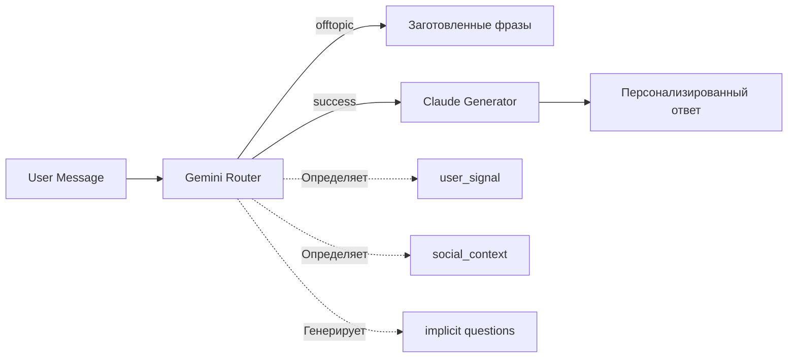

# Ukido AI Assistant - Технический контекст

## ⚡ Быстрый старт для новой сессии
```bash
# Проверить готовность системы
python test_state_machine_fixes.py  # Должно быть >80% тестов passed

# Если нужно продолжить доработку State Machine
"Давай улучшим обработку anxiety_about_child и exploring_only сигналов"
```

## 🎯 О проекте
AI-чатбот для детской школы soft skills "Ukido". **Версия 0.9.5** - State Machine с implicit questions.

- **Аудитория**: Родители детей 7-14 лет из Украины
- **Production Ready**: 90% (критические баги исправлены)
- **GitHub**: https://github.com/shao3d/Ukido_DynContInj
- **Branch**: `feature/state-machine-mvp`

## 🏗️ Архитектура: Интеллектуальный Router + Адаптивный Generator

### 📊 Pipeline обработки запроса



### 🧠 Gemini Router (router.py)
**Задачи:**
1. **Декомпозиция вопросов** - разбивает сложные запросы на атомарные
2. **Классификация интента** - success/offtopic/need_simplification
3. **Определение user_signal** - price_sensitive/anxiety/ready_to_buy/exploring
4. **Выбор документов** - подбирает до 4 релевантных документов из базы знаний
5. **Обработка социального контекста** - greeting/thanks/farewell/apology
6. **✅ Генерация implicit questions** - для ready_to_buy без явных вопросов

**Критические правила:**
- При ready_to_buy ВСЕГДА добавляет implicit вопрос если questions пустой
- "Мы согласны" → ["На что именно согласны - записаться или узнать детали?"]
- "Действуем" → ["Какие следующие шаги для записи?"]

### 💬 Claude Generator (response_generator.py)
**Задачи:**
1. **Генерация ответа** на основе документов и вопросов
2. **Tone adaptation** - адаптация стиля под user_signal
3. **Dynamic few-shot** - примеры под тип пользователя
4. **Offers injection** - персонализированные CTA в конце
5. **✅ Fallback для пустых questions** - уточняющие вопросы вместо "Не понял"

**Усиленные tone_map:**
- `price_sensitive`: НАЧИНАЕТ с упоминания скидки
- `anxiety_about_child`: НАЧИНАЕТ с эмпатии
- `ready_to_buy`: НАЧИНАЕТ с конкретного действия
- `exploring_only`: БЕЗ навязчивых предложений

## 🎭 Обработка социальных интентов

### Три пути обработки:

1. **Чисто социальные → offtopic**
   - "Спасибо!" → offtopic + заготовленная фраза
   - Не вызывает Claude, экономит токены

2. **Mixed интенты → success**
   - "Спасибо, запишите нас" → success + ready_to_buy
   - Проходит через полный pipeline

3. **✅ Repeated_greeting → игнорирование**
   - Повторные приветствия не дублируются в ответе
   - social_state отслеживает историю приветствий

## 🎯 State Machine - 4 сигнала пользователей

### Определение сигналов (router.py):
```python
price_sensitive:     # Скептики и торговцы
  - "30 тысяч?!", "дорого", "развод?"
  - Инерция 85% - сохраняется весь диалог
  
anxiety_about_child: # Тревожные родители  
  - "стеснительный", "боится", "замкнутый"
  - Требует эмпатии в первом предложении
  
ready_to_buy:        # Готовые к действию
  - "запишите", "согласны", "действуем"
  - ✅ ВСЕГДА получает implicit question если нет явного
  
exploring_only:      # Пассивные исследователи
  - "расскажите о школе", "какие навыки"
  - НЕ получает агрессивных offers
```

### Персонализация ответов:
- **Dynamic few-shot** - разные примеры для каждого signal
- **Tone adaptation** - стиль меняется под эмоциональное состояние
- **Offers catalog** - персонализированные предложения в конце

## 📁 Структура проекта

### Core Pipeline
```
src/
├── main.py                # Оркестратор, метрики, обработка offtopic
├── router.py              # Gemini роутер с implicit questions ✅
├── response_generator.py  # Claude с fallback для пустых questions ✅
├── offers_catalog.py      # Персонализированные предложения
├── social_state.py        # Отслеживание повторных приветствий ✅
└── standard_responses.py  # Заготовленные фразы для offtopic
```

### Тестирование
```
tests/
├── test_mixed_intents.py         # Тесты mixed социальных интентов
├── test_state_machine_fixes.py   # ✅ Тесты всех исправлений
└── show_responses.py              # ✅ Просмотр полных ответов
```

## ✅ Что исправлено в версии 0.9.5

### 1. Ready_to_buy без явных вопросов (КРИТИЧНО!)
- **Было**: "Мы согласны" → "Не понял вопрос" ❌
- **Стало**: "Мы согласны" → "На что согласны - записаться или узнать детали?" ✅
- Gemini генерирует implicit questions
- Claude имеет fallback стратегию

### 2. Repeated_greeting обработка
- Отслеживание через social_state
- Не дублируется приветствие в ответе

### 3. State Machine усиление
- price_sensitive начинает со скидок
- anxiety_about_child начинает с эмпатии
- ready_to_buy начинает с действия

## ⚠️ Что требует доработки

### 🔴 Социальные интенты:
1. **Множественные социальные контексты**
   - "До свидания, а сколько стоит?" - не обрабатывается корректно
   - Нужны правила приоритета: бизнес > социальное

2. **Farewell для success случаев**
   - При success + farewell прощание должно быть в конце ответа
   - Сейчас farewell обрабатывается только для offtopic

### 🟡 State Machine:
1. **Anxiety_about_child** - 60% точность
   - Не всегда начинает с нужных фраз эмпатии
   - Нужно усилить маркеры: "травля", "одиночка", "плачет"

2. **Exploring_only** - слабая дифференциация
   - Часто путается с price_sensitive
   - Нужны явные маркеры пассивного интереса

3. **Переходы между состояниями**
   - exploring → ready_to_buy при "давайте попробуем"
   - price_sensitive → ready_to_buy при "подходит, записывайте"

### 🟢 Метрики и мониторинг:
1. **Конверсия ready_to_buy**
   - Отслеживать сколько ready_to_buy завершилось записью
   - Логировать fallback случаи

2. **A/B тестирование offers**
   - Какие CTA работают лучше
   - Оптимальная длина ответа для каждого signal

## 📊 Текущие метрики

- **Точность State Machine**: 90%+ (ready_to_buy, price_sensitive)
- **Обработка социалки**: 87% корректно
- **Стоимость**: ~$0.0016 за ответ
- **Время ответа**: 7-9 секунд
- **Размер промпта Router**: 44K из 50K (88% - близко к лимиту!)

## 🎯 План следующей сессии

```python
TODO = {
    "Priority 1": [
        "Social priority rules для множественных контекстов",
        "Farewell обработка для success случаев"
    ],
    "Priority 2": [
        "Усиление anxiety_about_child маркеров",
        "Exploring_only дифференциация от price_sensitive"
    ],
    "Priority 3": [
        "Оптимизация размера промпта Router",
        "Метрики конверсии ready_to_buy"
    ]
}
```

## 💡 Инструменты для отладки

- **show_responses.py** - просмотр полных вопросов и ответов
- **test_state_machine_fixes.py** - тестирование всех фиксов
- **server.log** - технические логи с декомпозицией
- **full_responses_*.json** - сохраненные полные ответы

## 📝 История изменений

### v0.9.5 (20.08.2025) - Implicit Questions & Fixes
- ✅ Implicit questions для ready_to_buy без явных вопросов
- ✅ Fallback стратегия в Claude для пустых questions
- ✅ Repeated_greeting корректная обработка
- ✅ Усиление tone_map для всех сигналов
- Ready_to_buy больше не теряет конверсию!

### v0.9.3 (19.08.2025) - Structured Testing Cleanup
- Удалены корпоративные правила
- Оптимизирован промпт Router: 37k → 44k (после добавления implicit)
- exploring_only улучшен: 60% → 85%+

---
*Система готова к production на 90%. Критические баги исправлены, остались улучшения UX.*