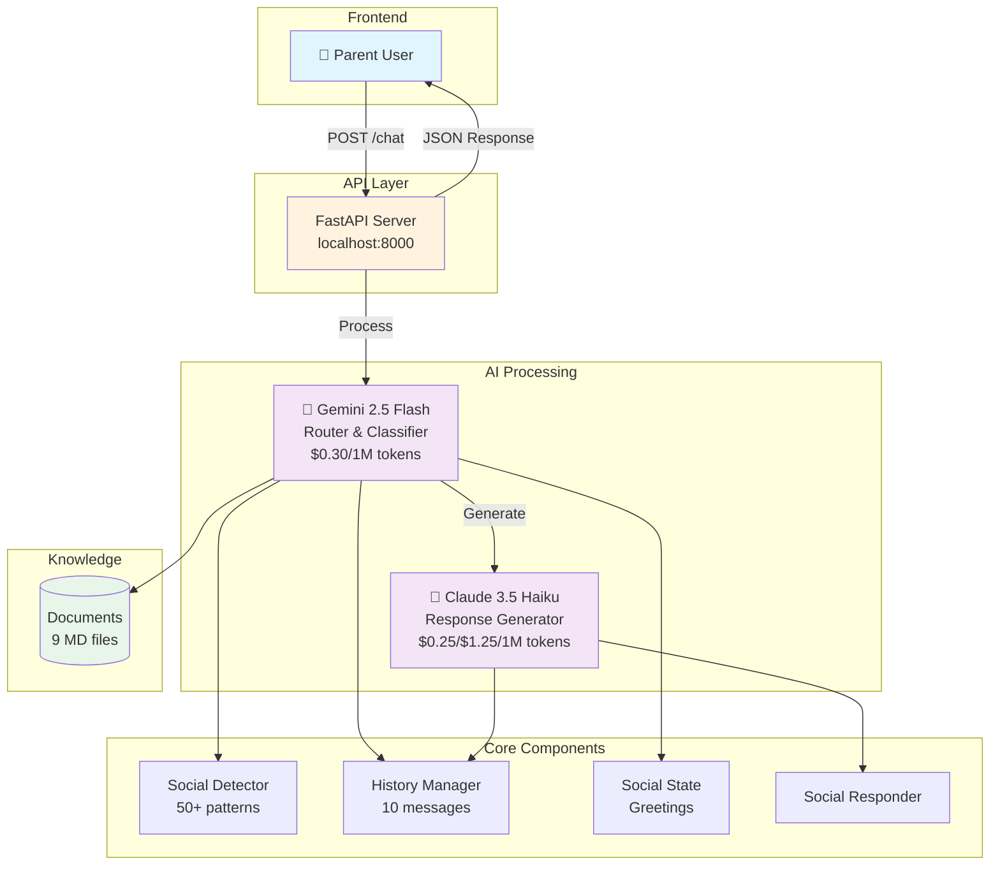
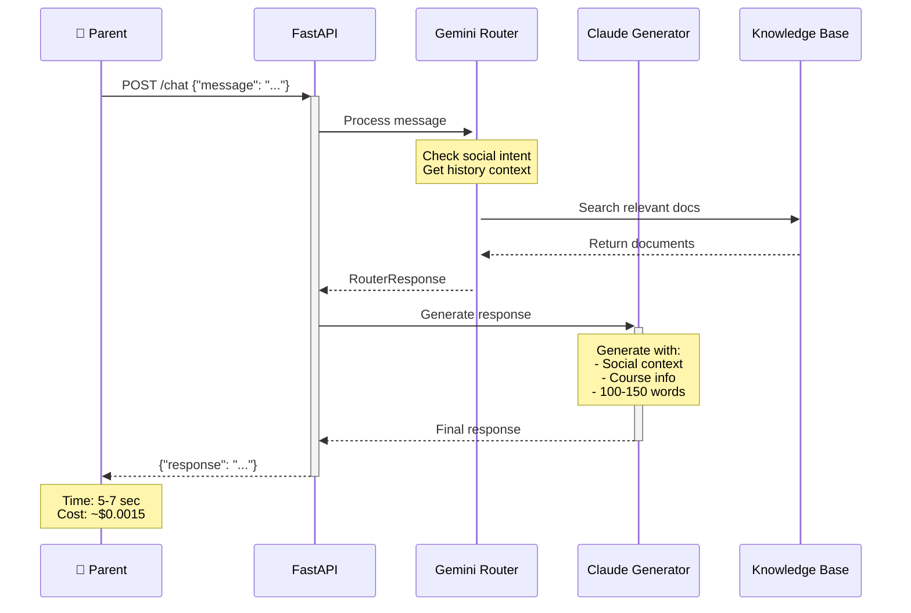
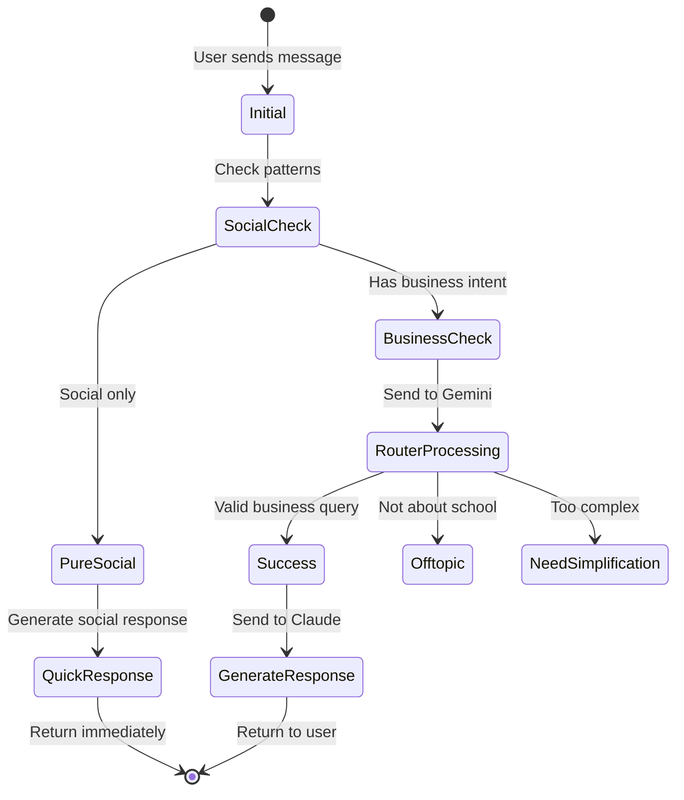
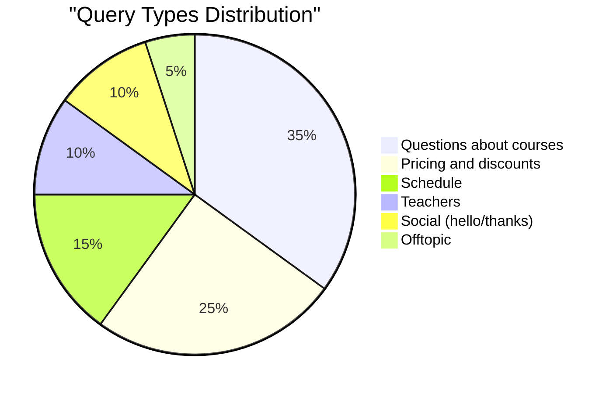
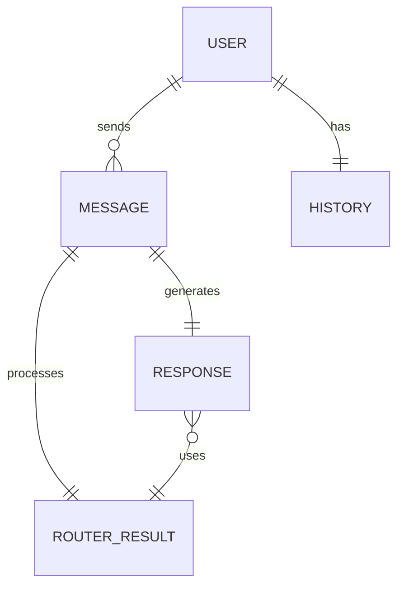

# 🤖 Ukido AI Assistant

[](https://www.python.org/downloads/)
[](https://fastapi.tiangolo.com/)
[](LICENSE)

AI-powered chatbot for Ukido soft skills school. Built with FastAPI, Gemini Router, and Claude Generator for dynamic context-aware responses to parent inquiries.

## 🎯 Features

- **Two-stage AI Architecture**: Gemini for routing + Claude for generation
- **Smart Intent Classification**: Business, social, and mixed intents handling
- **Context-Aware Responses**: Maintains conversation history (last 10 messages)
- **Fuzzy Matching**: Handles typos and variations (85% threshold)
- **Social Intelligence**: Tracks greetings, detects repeated social intents
- **Ultra-brief Query Expansion**: Contextualizes queries like "А?" from history
- **Optimized Performance**: 5-7 seconds response time, ~$0.0015 per query

## 🏗️ Architecture

### System Architecture


### Request Flow


## 🚀 Quick Start

### Prerequisites

- Python 3.11+
- API Keys for OpenRouter (Claude) and Google AI (Gemini)

### Installation

1. Clone the repository:
```bash
git clone https://github.com/shao3d/Ukido_DynContInj.git
cd Ukido_DynContInj
```

2. Install dependencies:
```bash
pip install -r requirements.txt
```

3. Set up environment variables:
```bash
cp .env.example .env
# Edit .env with your API keys:
# OPENROUTER_API_KEY=your_key
# GOOGLE_API_KEY=your_key (optional, for Gemini)
```

4. Run the server:
```bash
python src/main.py
```

The API will be available at `http://localhost:8000`

## 🧪 Testing

### Interactive Sandbox
```bash
# Interactive mode
python sandbox_v2.py

# Test single message
python sandbox_v2.py -m "Привет! Какие курсы есть?"

# Run automated tests
python sandbox_v2.py --test
```

### Stress Testing
```bash
python tests/test_stress_with_report.py
```

### Dialogue Testing
```bash
python collaborative_test.py 1  # By scenario number
python collaborative_test.py "Забывчивая бабушка"  # By name
```

## 📊 Architecture Diagrams

🎨 **[View Interactive Diagrams](https://shao3d.github.io/Ukido_DynContInj/)** - with zoom, pan, and navigation!

### Processing States


### Query Distribution


### Data Structure


The architecture diagrams above are created using Mermaid and are automatically rendered by GitHub in the README.
For high-resolution PNG versions, check the `docs/diagrams/` folder.

## 📁 Project Structure

```
├── src/
│   ├── main.py              # FastAPI server & orchestrator
│   ├── router.py             # Gemini intent classifier
│   ├── response_generator.py # Claude response generator
│   ├── history_manager.py    # Conversation history
│   └── social_state.py       # Social intent tracking
├── data/
│   └── documents_compressed/ # Knowledge base (9 documents)
├── tests/
│   ├── integration/          # Integration tests
│   └── reports/              # Test reports
├── docs/
│   ├── architecture/         # Architecture documentation
│   └── diagrams/            # Auto-generated diagrams
└── sandbox_v2.py            # Interactive testing tool
```

## 🔧 Configuration

Key settings in `src/config.py`:
- `HISTORY_LIMIT = 10` - Messages to keep in context
- `TEMPERATURE = 0.7` - Response creativity
- `USE_QUICK_REGEX = False` - Regex pre-processing (disabled)

## 📈 Performance Metrics

- **Response Time**: 5-7 seconds average
- **Cost**: ~$0.0015 per interaction
- **Accuracy**: 95%+ intent classification
- **Context Retention**: Last 10 messages

## 🤝 Contributing

1. Fork the repository
2. Create your feature branch (`git checkout -b feature/AmazingFeature`)
3. Commit your changes (`git commit -m 'Add some AmazingFeature'`)
4. Push to the branch (`git push origin feature/AmazingFeature`)
5. Open a Pull Request

## 📝 Version History

- **v0.7.6** (2025-08-17): Complete project reorganization
- **v0.7.5**: First 2 sentences rule implementation
- **v0.7.4**: Simplified repetition handling
- **v0.7.0-0.7.3**: Architecture optimizations
- **v0.6.x**: Initial implementation

## 🏫 About Ukido

Ukido is a soft skills school for children aged 7-14, focusing on emotional intelligence, leadership, and communication skills development.

## 📄 License

This project is licensed under the MIT License - see the [LICENSE](LICENSE) file for details.

## 🙏 Acknowledgments

- Ukido team for domain expertise
- OpenRouter for Claude API access
- Google AI for Gemini API
- FastAPI community for the excellent framework

---

**Built with ❤️ for better parent-school communication**