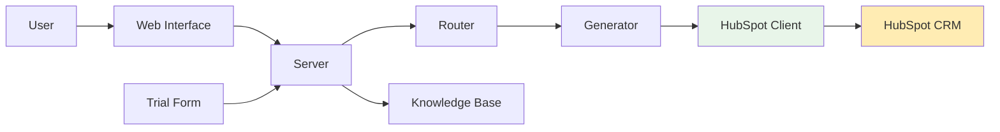
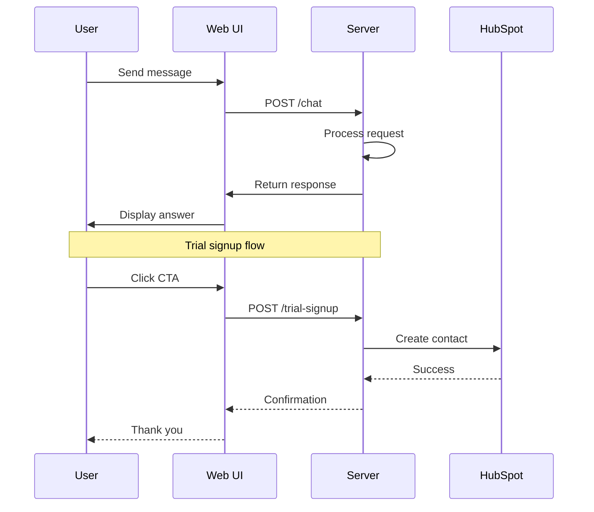
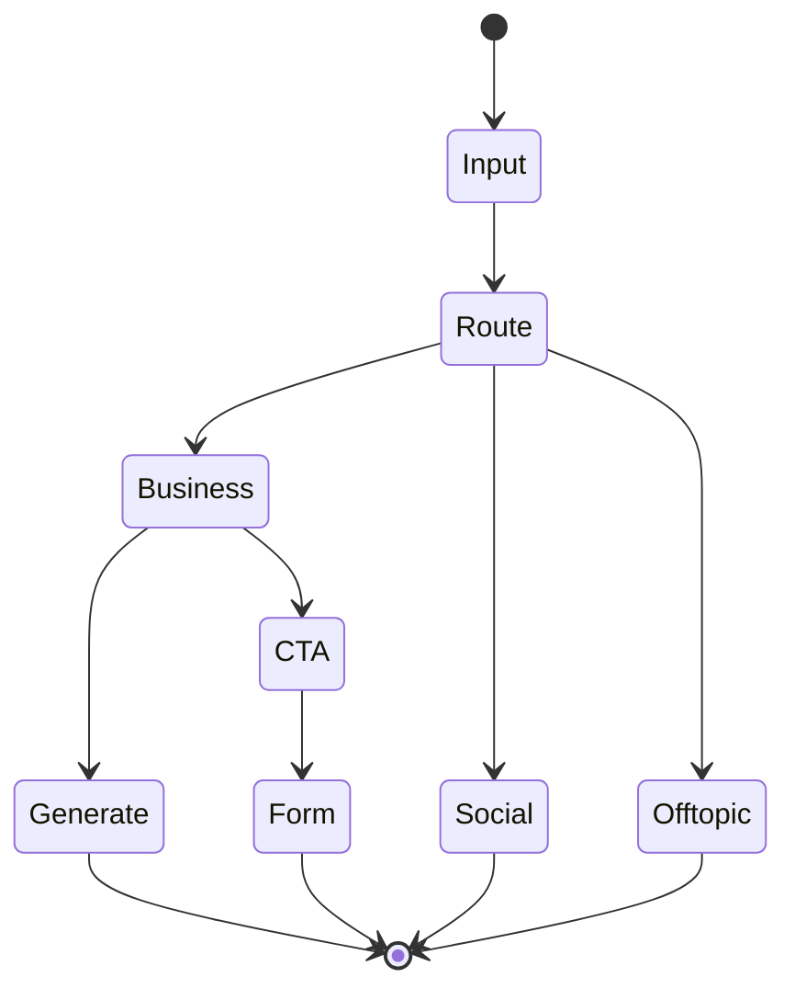
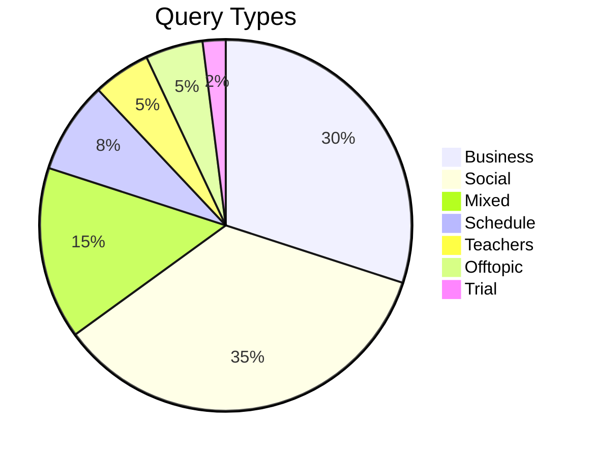
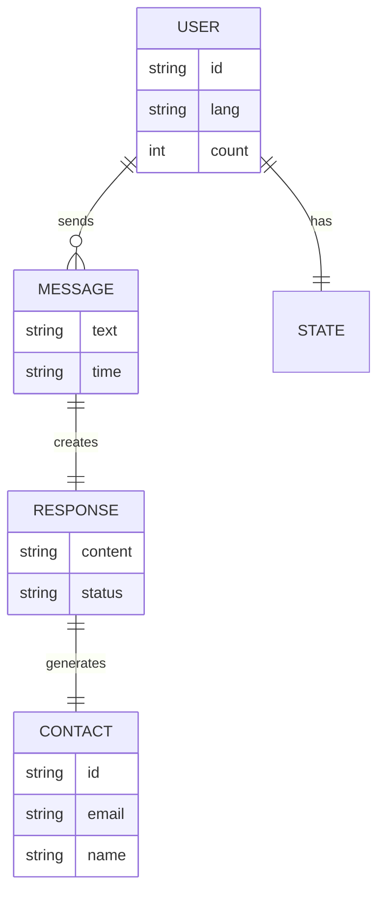

# 🤖 Ukido AI Assistant

[](https://www.python.org/downloads/)
[](https://fastapi.tiangolo.com/)
[](https://www.docker.com/)
[](LICENSE)

Production-ready AI chatbot for Ukido soft skills school with multilingual support, real-time streaming interface, and HubSpot CRM integration.

## 🎯 Key Features

### Core Capabilities
- **🌐 Multilingual Support**: Russian, Ukrainian, and English with real-time translation
- **💬 Web Chat Interface**: Beautiful SSE-powered chat with live streaming responses
- **🤖 Two-stage AI Architecture**: Gemini for routing + Claude for generation
- **😄 Zhvanetsky Humor Engine**: Context-aware humor for offtopic queries (80% probability)
- **💾 State Persistence**: Full conversation history and user state preservation
- **🐳 Docker Ready**: One-click deployment with Railway support
- **🎯 HubSpot CRM Integration**: Automated trial lesson signup and contact management

### Technical Features
- **Smart Intent Classification**: Business, social, and mixed intents handling
- **Adaptive Tone System**: 4 user emotional states (ready_to_buy, anxiety, price_sensitive, exploring)
- **CTA Intelligence**: Smart call-to-action blocking based on user behavior
- **Context Memory**: Maintains last 10 messages with offtopic filtering
- **Protected Terms**: Preserves brand names during translation (Ukido, soft skills, Zoom)
- **HubSpot API**: Direct integration with HubSpot CRM for contact creation/updates
- **Production Pipeline**: Chat → CTA → Trial Form → Railway → HubSpot CRM
- **Optimized Performance**: 5-7 seconds response time, ~$0.0015 per query

## 🏗️ Architecture

### System Architecture (v0.17.0)


### Request Flow (v0.17.0)


## 🚀 Quick Start

### Prerequisites

- Python 3.11+
- API Key for OpenRouter (required)

### Installation

1. Clone the repository:
```bash
git clone https://github.com/shao3d/Ukido_DynContInj.git
cd Ukido_DynContInj
```

2. Install dependencies:
```bash
python3 -m venv venv
source venv/bin/activate  # On Windows: venv\Scripts\activate
pip install -r requirements.txt
```

3. Set up environment variables:
```bash
cp .env.example .env
# Edit .env and add your API keys:
# OPENROUTER_API_KEY=sk-or-v1-xxxxx
# HUBSPOT_PRIVATE_APP_TOKEN=pat-eu1-xxxxx
# HUBSPOT_PORTAL_ID=1234567
```

4. Run the server:
```bash
python src/main.py
```

5. Open the web interface:
- **Web Chat**: http://localhost:8000
- **API Docs**: http://localhost:8000/docs

### 🐳 Docker Deployment

```bash
# Build and run with Docker
docker build -t ukido-assistant .
docker run -p 8000:8000 --env-file .env ukido-assistant
```

### 🌐 Production Deployment (Railway)

1. **Deploy to Railway**:
   ```bash
   git push origin main
   # Railway will auto-detect and deploy
   ```

2. **Configure Environment Variables** in Railway:
   ```
   OPENROUTER_API_KEY=sk-or-v1-xxxxx
   HUBSPOT_PRIVATE_APP_TOKEN=pat-eu1-xxxxx
   HUBSPOT_PORTAL_ID=1234567
   ```

3. **Access the application**:
   - **Chat**: https://ukidoschool.up.railway.app
   - **Trial Form**: https://shao3d.github.io/trial/
   - **API Docs**: https://ukidoschool.up.railway.app/docs

## 📡 API Endpoints

### Core Chat API
- **`POST /chat`** - Main chat endpoint
  - Request: `{"user_id": "string", "message": "string"}`
  - Response: `{"response": "string", "intent": "string", "user_signal": "string", "humor_generated": bool}`

### Trial Signup API
- **`POST /trial-signup`** - HubSpot CRM integration
  - Request: `{"firstName": "string", "lastName": "string", "email": "string", "phone": "string"}`
  - Response: `{"success": bool, "message": "string", "contact_id": "string", "action": "string"}`

### System Endpoints
- **`GET /chat/stream`** - SSE streaming for real-time responses
- **`GET /health`** - Health check endpoint
- **`GET /metrics`** - System performance metrics

## 🧪 Testing

### Interactive Sandbox
```bash
# Interactive mode
python sandbox_v2.py

# Test single message
python sandbox_v2.py -m "Привет! Какие курсы есть?"

# Run automated tests
python sandbox_v2.py --test
```

### Stress Testing
```bash
python tests/test_stress_with_report.py
```

### Dialogue Testing
```bash
python collaborative_test.py 1  # By scenario number
python collaborative_test.py "Забывчивая бабушка"  # By name
```

## 📊 Architecture Diagrams

### 🎨 Интерактивные визуализации:
- **[Простые диаграммы](https://shao3d.github.io/Ukido_DynContInj/simple-diagrams.html)** - чистый Mermaid.js без зависимостей
- **[Конвертер в Excalidraw](https://shao3d.github.io/Ukido_DynContInj/mermaid-to-excalidraw.html)** - превратите диаграммы в рисунки
- **[Интерактивные диаграммы](https://shao3d.github.io/Ukido_DynContInj/)** - с zoom и навигацией (экспериментальная)
- **[GitDiagram](https://gitdiagram.com/shao3d/Ukido_DynContInj)** - автоматическая визуализация структуры репозитория

### Processing States (v0.17.0)


### Query Distribution (v0.17.0)


### Data Structure (v0.17.0)


The architecture diagrams above are created using Mermaid and are automatically rendered by GitHub in the README.

## 📁 Project Structure

```
├── src/
│   ├── main.py              # FastAPI server & orchestrator
│   ├── router.py             # Gemini intent classifier
│   ├── response_generator.py # Claude response generator
│   ├── hubspot_client.py     # 🆕 HubSpot CRM API client
│   ├── history_manager.py    # Conversation history
│   └── social_state.py       # Social intent tracking
├── data/
│   ├── persistent_states/      # User session persistence
│   └── documents_compressed/   # Knowledge base (13 documents)
├── tests/
│   ├── integration/          # Integration tests
│   └── reports/              # Test reports
├── docs/
│   ├── architecture/         # Architecture documentation
│   └── diagrams/            # Auto-generated diagrams
├── sandbox_v2.py            # Interactive testing tool
└── trial/                   # 🆕 Trial lesson form (GitHub Pages)
```

## 🔧 Configuration

Key settings in `src/config.py`:
- `HISTORY_LIMIT = 10` - Messages to keep in context
- `TEMPERATURE = 0.7` - Response creativity
- `USE_QUICK_REGEX = False` - Regex pre-processing (disabled)

## 📈 Performance Metrics

- **Response Time**: 5-7 seconds average
- **Cost**: ~$0.0015 per interaction
- **Accuracy**: 95%+ intent classification
- **Context Retention**: Last 10 messages

## 🤝 Contributing

1. Fork the repository
2. Create your feature branch (`git checkout -b feature/AmazingFeature`)
3. Commit your changes (`git commit -m 'Add some AmazingFeature'`)
4. Push to the branch (`git push origin feature/AmazingFeature`)
5. Open a Pull Request

## 📝 Version History

- **v0.17.0** (2025-10-16): 🎯 **HubSpot CRM Integration** - Full trial signup automation
  - POST /trial-signup endpoint with HubSpot API integration
  - Production pipeline: Chat → CTA → Trial Form → Railway → HubSpot CRM
  - GitHub Pages trial form integration (shao3d.github.io/trial/)
  - Contact creation/update with ID tracking
  - Railway deployment with environment variables
- **v0.16.1** (2025-01-10): Full multilingual support (RU/UK/EN) with streaming translation
- **v0.15.0** (2025-01-07): SSE web interface and Docker deployment
- **v0.14.x**: Production optimizations and bug fixes
- **v0.13.x**: Zhvanetsky humor engine integration
- **v0.12.x**: State persistence and advanced CTA blocking
- Earlier versions: Initial architecture and core features

## 🌿 Branch Structure

- **main**: Latest stable version with all features
- **feature/multilingual-v2**: Active development (merged)
- **archive/***: Historical feature branches for reference

## 🏫 About Ukido

Ukido is a soft skills school for children aged 7-14, focusing on emotional intelligence, leadership, and communication skills development.

## 📄 License

This project is licensed under the MIT License - see the [LICENSE](LICENSE) file for details.

## 🙏 Acknowledgments

- Ukido team for domain expertise
- OpenRouter for Claude API access
- Google AI for Gemini API
- FastAPI community for the excellent framework

---

**Built with ❤️ for better parent-school communication**