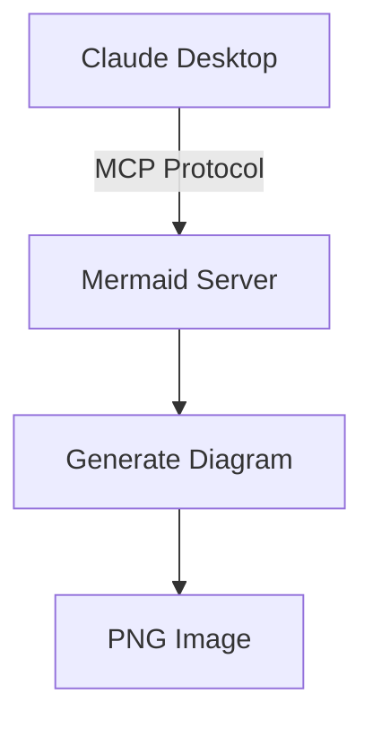

# Решение проблемы с Mermaid MCP сервером

## Проблема
Mermaid MCP сервер не отображался в списке подключенных серверов Claude Desktop из-за:
1. Использования неправильного npm пакета (`mcp-mermaid` вместо `@peng-shawn/mermaid-mcp-server`)
2. Поврежденного JSON конфигурационного файла
3. Возможных конфликтов с NVM (Node Version Manager)

## Решение

### Вариант 1: Использование @peng-shawn/mermaid-mcp-server (рекомендуется)
Этот пакет активно поддерживается и конвертирует Mermaid диаграммы в PNG изображения.

**Конфигурация:**
```json
{
  "mcpServers": {
    "mermaid": {
      "command": "npx",
      "args": ["-y", "@peng-shawn/mermaid-mcp-server"]
    }
  }
}
```

### Вариант 2: Альтернативный путь через полный путь к npx
Если у вас проблемы с NVM, укажите полный путь:

```json
{
  "mcpServers": {
    "mermaid": {
      "command": "/Users/andreysazonov/.nvm/versions/node/v18.20.8/bin/npx",
      "args": ["-y", "@peng-shawn/mermaid-mcp-server"]
    }
  }
}
```

### Вариант 3: Установка глобально и использование без npx
```bash
# Установка глобально
npm install -g @peng-shawn/mermaid-mcp-server

# Найти путь к установленному пакету
npm list -g --depth=0 | grep mermaid
```

Затем в конфигурации использовать прямой путь к исполняемому файлу.

## Проверка работоспособности

### 1. Валидация JSON конфигурации
```bash
python3 -m json.tool ~/Library/Application\ Support/Claude/claude_desktop_config.json
```

### 2. Тестирование пакета вне Claude
```bash
# Должен зависнуть, ожидая MCP соединения (это нормально)
npx -y @peng-shawn/mermaid-mcp-server
# Прервите с Ctrl+C
```

### 3. Проверка логов Claude Desktop
После перезапуска Claude Desktop, включите Developer Mode:
- Settings → Developer → Enable Developer Mode
- Проверьте логи MCP на наличие ошибок

## Возможности Mermaid MCP сервера

После успешного подключения вы сможете:
- Генерировать диаграммы из текстового описания Mermaid
- Конвертировать диаграммы в PNG изображения
- Создавать flowcharts, sequence diagrams, gantt charts и другие типы диаграмм

## Пример использования



## Troubleshooting

### Если сервер все еще не появляется:

1. **Проверьте процессы:**
```bash
ps aux | grep -i claude
# Убедитесь, что все процессы Claude завершены перед перезапуском
```

2. **Очистите npm кеш:**
```bash
npm cache clean --force
```

3. **Проверьте права доступа:**
```bash
ls -la ~/Library/Application\ Support/Claude/
# Должны быть права на запись
```

4. **Альтернативные MCP серверы для диаграмм:**
- Sailor: `npx -y @aj-geddes/sailor`
- График-генератор через Puppeteer: `@modelcontextprotocol/server-puppeteer`

## Ресурсы
- [MCP Servers Registry](https://mcpservers.org/)
- [Model Context Protocol Docs](https://modelcontextprotocol.io/)
- [@peng-shawn/mermaid-mcp-server на GitHub](https://github.com/peng-shawn/mermaid-mcp-server)