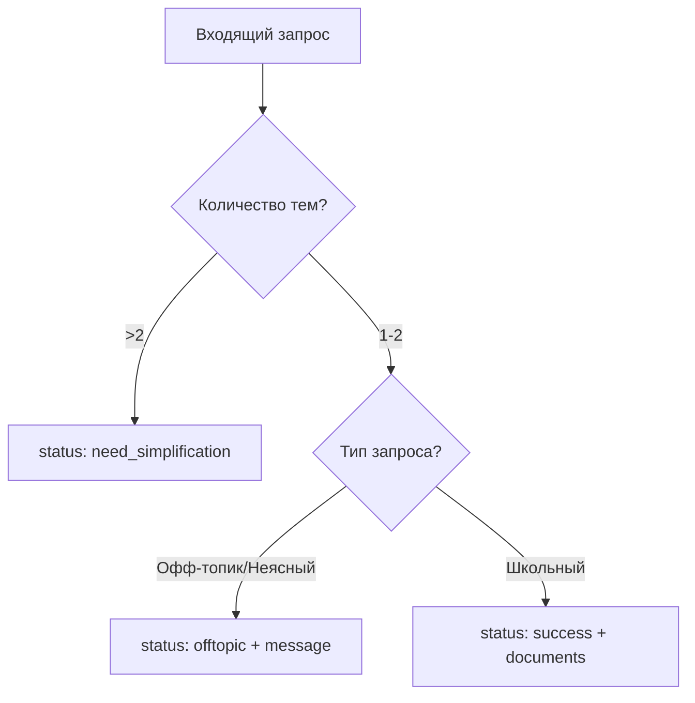

# 🎯 Спецификация Router Component

## Описание

Router - интеллектуальный компонент системы Dynamic Context Injection, который анализирует запросы пользователей и принимает решения о дальнейшей обработке. Работает на базе google/gemini-2.5-flash через OpenRouter API.

## Основные функции

1. **Классификация запросов** в статусы: success, offtopic, need_simplification
2. **Декомпозиция** составных вопросов (контроль числа атомарных вопросов)
3. **Выбор релевантных документов** для школьных запросов (максимум 4 документа)
4. **Учёт истории диалога** для понимания контекста

## Архитектура обработки запросов

```
[Новое сообщение от пользователя]
           ↓
[Роутер + История (до 20 последних)]
           ↓
    Классификация
    ↙          ↘
Классы: success | offtopic | need_simplification
    ↙                   ↘
  [Ответ роутера]     [Основной генератор]
               ↓
             [Полный ответ]
    ↘          ↙
  [Сборщик истории]
         ↓
  [Единое хранилище]
```

### Экономия токенов
Офф-топик и чрезмерно сложные запросы (need_simplification) обрабатываются самим роутером сообщением без передачи на основной генератор, что экономит токены и ускоряет ответы.

## История диалога

### Формат хранения
```python
history = [
    {"role": "user", "content": "Привет!"},
    {"role": "assistant", "content": "Здравствуйте! Рад помочь с информацией о школе Ukido."},
    {"role": "user", "content": "Сколько стоит курс?"},
    {"role": "assistant", "content": "Курс 'Юный Оратор' стоит 6,000 грн в месяц..."}
]
```

### Параметры истории
- **Максимальный размер:** 20 сообщений (10 от пользователя + 10 от ассистента)
- **Хранение:** In-memory словарь по user_id
- **Обработка:** Последовательная для каждого user_id (простейший вариант для MVP)

### Сборщик истории
После каждого ответа (от роутера или основного генератора):
1. Добавляет сообщение пользователя в историю
2. Добавляет ответ ассистента в историю  
3. Обрезает историю до 20 последних сообщений
4. Сохраняет в in-memory хранилище

### Класс управления историей
```python
class HistoryManager:
    def __init__(self):
        self.storage = {}  # {user_id: [messages]}
        self.max_messages = 20
    
    def add_user_message(self, user_id: str, content: str):
        """Добавляет сообщение пользователя"""
        self._add_message(user_id, "user", content)
    
    def add_assistant_message(self, user_id: str, content: str):
        """Добавляет ответ ассистента (от любого источника)"""
        self._add_message(user_id, "assistant", content)
    
    def _add_message(self, user_id: str, role: str, content: str):
        if user_id not in self.storage:
            self.storage[user_id] = []
        
        self.storage[user_id].append({
            "role": role,
            "content": content
        })
        
        # Обрезаем до 20 последних
        if len(self.storage[user_id]) > self.max_messages:
            self.storage[user_id] = self.storage[user_id][-self.max_messages:]
    
    def get_history(self, user_id: str) -> list:
        """Возвращает историю для передачи в роутер"""
        return self.storage.get(user_id, [])
```

## Структура промпта роутера

### 1. Первая статическая часть системного промпта - Роль и Правила

```
Ты - интеллектуальный роутер AI-ассистента детской онлайн-школы Ukido.

ТВОИ ОБЯЗАННОСТИ:
1. Анализировать входящие запросы пользователей
2. Классифицировать тип каждого запроса
3. Для школьных запросов выбирать релевантные документы
4. Учитывать контекст из истории диалога

ВАЖНЫЕ ПРАВИЛА:
- Максимум 2 темы в одном запросе пользователя
- Максимум 4 документа суммарно для всех тем  
- При выборе документов учитывай их взаимосвязи
- Офф-топик или неясные вопросы вежливо переспрашивай
- При смешанных запросах игнорируй не-школьные части

```

### 2. Вторая статическая часть системного промпта - Саммари документов школы

```
ДОСТУПНЫЕ ДОКУМЕНТЫ:
[Здесь будет вставлен JSON с саммари всех документов из summaries.json]
```

#### Формат саммари документов

Каждый документ описан в следующем формате:

```json
{
  "document_id": {
    "core_topics": "Краткое описание основных тем документа",
    "key_facts": "Ключевые факты и цифры",
    "typical_questions": [
      "Типичный вопрос 1",
      "Типичный вопрос 2"
    ],
    "trigger_words": ["слово1", "слово2", "слово3"],
    "related_docs": ["связанный_документ1.md"],
    "unique_value": "Что уникального в этом документе"
  }
}
```

#### Примеры саммари:

```json
{
  "pricing.md": {
    "core_topics": "Полная информация о стоимости всех курсов, всех видах скидок, вариантах оплаты, гарантиях возврата",
    "key_facts": "Юный Оратор 6000 грн/мес (3 мес), Эмоциональный Компас 7000 грн/мес (4 мес), Капитан Проектов 8000 грн/мес (5 мес). Скидки: семейная 15%, полная оплата 10%, социальная 20%",
    "typical_questions": [
      "Сколько стоит курс",
      "Есть ли скидки",
      "Можно ли в рассрочку"
    ],
    "trigger_words": ["цена", "стоимость", "стоит", "оплата", "скидка", "рассрочка", "дорого", "грн"],
    "related_docs": ["courses_detailed.md"],
    "unique_value": "Единственный полный источник актуальных цен и скидок"
  },
  
  "teachers_team.md": {
    "core_topics": "Подробная информация о 4 преподавателях: квалификация, опыт, методики работы",
    "key_facts": "Анна Коваленко (Юный Оратор, 8 лет опыта), Дмитрий Петров (Эмоциональный Компас, PhD), Елена Сидорова (Капитан Проектов, MBA), Ольга Мирная (методист)",
    "typical_questions": [
      "Кто преподаёт",
      "Какая квалификация у учителей"
    ],
    "trigger_words": ["преподаватель", "учитель", "педагог", "Анна", "Дмитрий", "Елена", "квалификация"],
    "related_docs": ["methodology.md", "faq.md"],
    "unique_value": "Единственный источник с детальными подходами каждого преподавателя"
  }
}
```

### 3. История диалога

```
ИСТОРИЯ ДИАЛОГА (последние 20 сообщений):
User: [сообщение пользователя]
Assistant: [ответ ассистента]
User: [следующее сообщение]
Assistant: [следующий ответ]
...

Используй эту историю для:
- Понимания контекста неполных вопросов (например, "А сколько это стоит?")
- Отслеживания тем, которые уже обсуждались
- Понимания потребностей пользователя из предыдущих вопросов
```

### 4. Текущий запрос пользователя

```
ТЕКУЩИЙ ЗАПРОС:
User: [актуальный вопрос пользователя]
User name: [имя если известно]

Проанализируй этот запрос с учётом истории диалога.
```

### 5. Инструкция по декомпозиции

```
ДЕКОМПОЗИЦИЯ ЗАПРОСА:
1. Определи, содержит ли запрос несколько тем
2. Если тем больше 2, то верни status "need_simplification" и такое сообщение: "Пожалуйста, задавайте не более двух вопросов за раз. Например, начните с самого важного для вас."
3. Если тем 1-2, продолжай классификацию
4. Игнорируй социальные добавки (привет, спасибо, прощание) при подсчёте тем
5. Учитывай контекст из истории при интерпретации неполных вопросов
```

### 6. Инструкция по классификации и обработке

Единый набор статусов:

1. **success** — документы выбраны для генератора
2. **offtopic** — не по теме школы или неясно
3. **need_simplification** — слишком много тем (3+)

КЛАССИФИКАЦИЯ И ОБРАБОТКА:

При анализе запроса используй:
- trigger_words из саммари для поиска релевантных документов
- typical_questions для понимания, какие вопросы покрывает документ
- core_topics для семантического сопоставления

1. Если запрос содержит больше 2 тем:
   - status: "need_simplification"
   - message: "Пожалуйста, задавайте не более двух вопросов за раз."

2. (убрано) Социальные реплики не выделяются отдельным статусом

3. ОФФ-ТОПИК ИЛИ НЕЯСНО (не относится к школе ИЛИ неясный запрос без контекста):
  - status: "offtopic"
   - message: "Не совсем понял ваш вопрос. Я могу подробно рассказать о курсах школы Ukido, стоимости обучения, наших преподавателях, методиках работы с детьми или ответить на другие вопросы о развитии soft skills. Что именно вас интересует?"
   - НЕ выбирай документы

4. ШКОЛЬНЫЕ (любые вопросы о Ukido):
   - status: "success"
   - documents: выбери 1-2 релевантных документа для каждой темы. Общий лимит: 4 документа на весь запрос
   - Смотри на trigger_words и typical_questions в саммари
   - Учитывай related_docs для связанных тем
   - Используй историю для понимания контекста (например, "А это дорого?" после обсуждения курса)

СМЕШАННЫЕ ЗАПРОСЫ:
Если запрос содержит и школьные, и не-школьные элементы:
- Обработай только школьную часть
- Игнорируй социальные реплики и офф-топик
- Пример: "Привет! Сколько стоит курс и какая погода?" → обрабатывай только вопрос о цене

ФОРМАТ ОТВЕТА:
Верни JSON с правильным статусом и данными.
```

## Логика обработки запросов

### Алгоритм работы:




### Упрощённые правила выбора документов для MVP

Пусть google/gemini-2.5-flash сам решает на основе:
- `trigger_words` в саммари
- `typical_questions` в саммари
- Семантического сходства запроса с `core_topics`

#### Типичные связки документов (подсказки для GPT):

- **Вопросы о стоимости** → `pricing.md` + иногда `courses_detailed.md`
- **Стеснительный ребёнок** → `faq.md` + `teachers_team.md`
- **Конкретный курс** → `courses_detailed.md` + `pricing.md`
- **Результаты обучения** → `results_achievements.md` + `roi_and_future_benefits.md`
- **Безопасность** → `safety_and_trust.md` + `conditions.md`
- **Особые дети (СДВГ, РАС)** → `faq.md` + `methodology.md` + иногда `teachers_team.md`

Жёсткие правила приоритетов добавим после накопления статистики использования.

## Формат выходных данных роутера

1) Для success:
```json
{
  "status": "success",
  "documents": ["doc1.md", "doc2.md"],
  "decomposed_questions": ["Вопрос 1?", "Вопрос 2?"]
}
```

2) Для offtopic / need_simplification:
```json
{
  "status": "offtopic",
  "message": "Поясняющее сообщение",
  "decomposed_questions": []
}
```

Примечание: поле "decomposed_questions" опционально и может отсутствовать.

### Описание полей:

- **status**: Результат обработки
  - `success` - школьный запрос, документы выбраны
  - `offtopic` - не по теме школы или неясный запрос
  - `need_simplification` - слишком много тем

- **message**: Прямой ответ роутера (для всех статусов кроме success)

- **documents**: Список выбранных документов (только для success)

## Примеры работы роутера

### Пример 1: Простой школьный запрос
**Вход:** "Сколько стоит курс Юный Оратор?"  
**Классификация:** Школьный  
**Выход:**
```json
{
  "status": "success",
  "documents": ["pricing.md", "courses_detailed.md"]
}
```

<!-- Удалён пример социальной реплики как неактуальный -->

### Пример 2: Офф-топик
**Вход:** "Как приготовить борщ?"  
**Классификация:** Офф-топик/неясный  
**Выход:**
```json
{
  "status": "offtopic",
  "message": "Не совсем понял ваш вопрос. Я могу подробно рассказать о курсах школы Ukido, стоимости обучения, наших преподавателях или методиках работы с детьми."
}
```

### Пример 3: Неясный запрос
**Вход:** "А это того стоит?" (без контекста в истории)  
**Классификация:** Офф-топик/неясный  
**Выход:**
```json
{
  "status": "offtopic",
  "message": "Не совсем понял ваш вопрос. Я могу подробно рассказать о курсах школы Ukido, стоимости обучения, наших преподавателях или методиках работы с детьми."
}
```

### Пример 4: Превышение лимита тем
**Вход:** "Расскажите о ценах, преподавателях, партнёрах и летних программах"  
**Декомпозиция:** 4 темы  
**Выход:**
```json
{
  "status": "need_simplification",
  "message": "Пожалуйста, задавайте не более двух вопросов за раз. Например, начните с самого важного для вас."
}
```

### Пример 5: Контекстный запрос
**История:** Обсуждали курс "Юный Оратор"  
**Вход:** "А это дорого?"  
**Классификация:** Школьный (понятно из истории)  
**Выход:**
```json
{
  "status": "success",
  "documents": ["pricing.md"]
}
```

## Обработка специфических кейсов (упрощённо для MVP)

### Запросы о детях с особенностями:
**Вход:** "У моего ребёнка СДВГ, сможет ли он учиться?"  
**Решение:** GPT выберет документы по trigger_words "СДВГ", "особенности развития"  
**Вероятный выбор:** `faq.md`, `methodology.md`, `teachers_team.md`

### Сомнения в качестве:
**Вход:** "Это не развод на деньги?"  
**Решение:** Школьный запрос о доверии и результатах  
**Вероятный выбор:** `results_achievements.md`, `roi_and_future_benefits.md`

### Смешанные запросы:
**Вход:** "Привет! Сколько стоит курс?"  
**Решение:** Игнорируем "Привет", обрабатываем вопрос о цене  
**Вероятный выбор:** `pricing.md`, `courses_detailed.md`

### Неполные вопросы с контекстом:
**История:** Говорили про курс "Юный Оратор"  
**Вход:** "А сколько это стоит?"  
**Решение:** Используем историю для понимания контекста  
**Вероятный выбор:** `pricing.md`

## Разделы для будущего развития (НЕ для MVP)

### 📊 Метрики качества (ПОТОМ)
- Точность классификации
- Релевантность документов
- Скорость обработки

### 🔄 A/B тестирование (ПОТОМ)
- Разные версии промптов
- Сравнение эффективности

### 📝 Логирование и аналитика (ПОТОМ)
- Сохранение всех решений
- Анализ частоты выбора документов
- topics_detected для аналитики

### 🚨 Fallback стратегии (ПОТОМ)
- Сложные механизмы восстановления
- Альтернативные пути обработки


## Технические требования для MVP

### Зависимости:
- OpenRouter API с моделью google/gemini-2.5-flash
- Python 3.11+
- httpx для асинхронных HTTP запросов

### Переменные окружения:
```
OPENROUTER_API_KEY=your_api_key_here
```

### Простая обработка ошибок:
```python
try:
    # Вызов OpenRouter API
    response = await call_openrouter(prompt)
except Exception as e:
    # Для MVP просто возвращаем ошибку
    return {
        "status": "error",
        "message": "Временная проблема с сервисом. Попробуйте позже."
    }
```

---

*Версия: 1.3 (MVP с полным форматом саммари)*  