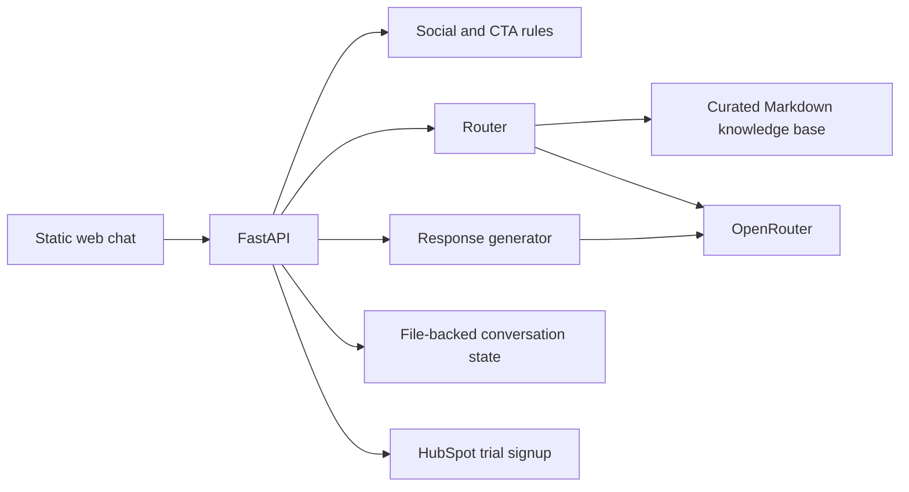

# Current architecture

Ukido is one FastAPI application with a static web client. The code deliberately
keeps business guardrails in Python and uses LLM calls only where classification,
generation or translation is needed.

## Request flow

1. `src/main.py` validates input, resolves the session language and applies
   in-memory request limits.
2. Deterministic social handlers can answer simple greetings, thanks,
   acknowledgements and farewells without a full generation call.
3. `src/router.py` classifies the request, detects the user signal, decomposes
   complex questions and selects relevant knowledge-base documents.
4. `src/response_generator.py` builds the answer from the selected facts and
   tone rules. `src/translator.py` handles non-Russian surfaces where needed.
5. CTA and completed-action rules post-process the result. The response and
   metadata are added to the short conversation history.
6. `/chat` returns JSON. `/chat/stream` runs the same processing path and emits
   the completed answer as SSE chunks; it is response streaming, not upstream
   token streaming from the model.

## Main boundaries

- `src/config.py` — environment and model configuration.
- `src/main.py` — API composition, validation, orchestration and lifecycle.
- `src/router.py` — intent, signal and document selection.
- `src/response_generator.py` — grounded answer construction.
- `src/localization.py` — deterministic `ru`/`uk`/`en` interface text.
- `src/history_manager.py` and `src/persistence_manager.py` — short history and
  snapshots.
- `src/social_*`, `src/simple_cta_blocker.py` and
  `src/completed_actions_handler.py` — deterministic dialogue guardrails.
- `src/hubspot_client.py` — isolated CRM integration.
- `data/documents*` and `data/summaries.json` — curated product knowledge.

## State and deployment

Conversation state is stored as JSON. In production,
`PERSISTENCE_BASE_PATH=/srv/bh/ukido/data/persistent_states`, outside the
release directory, so application swaps do not remove it. Rate limits and
aggregate metrics remain in process memory.

The canonical runtime is the user-scoped `ukido.service` on Beyond Horizon.
GitHub Actions tests and activates releases from `main`; the deployment script
keeps the previous application tree for rollback. Railway is retained only as
an external rollback option.

## Intentional constraints

- OpenRouter availability affects LLM-backed routes; deterministic responses
  and error fallbacks reduce, but do not remove, that dependency.
- State files are suitable for the current single-instance deployment, not for
  horizontal scaling without a shared store.
- The static client and API are deployed together; there is no separate
  frontend build pipeline.
