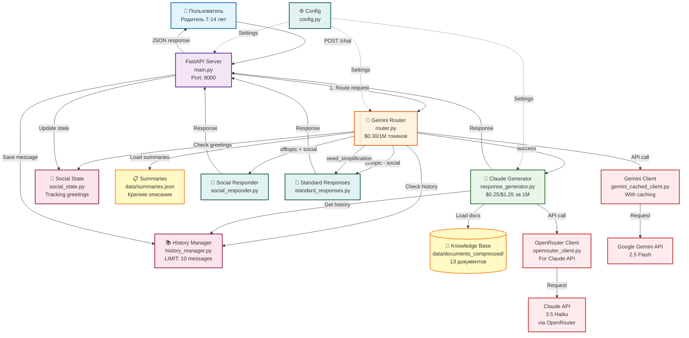
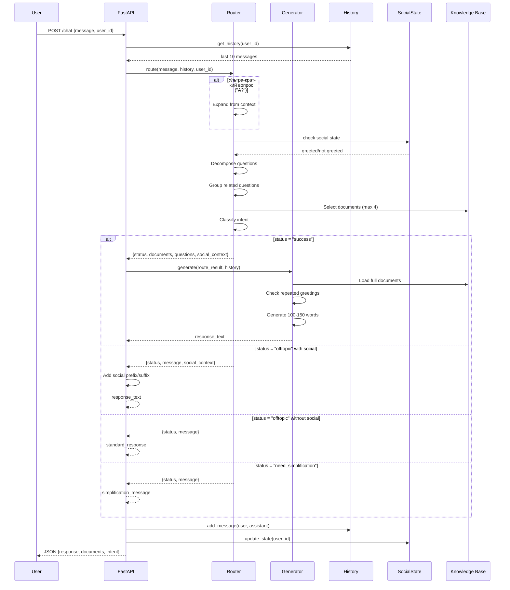
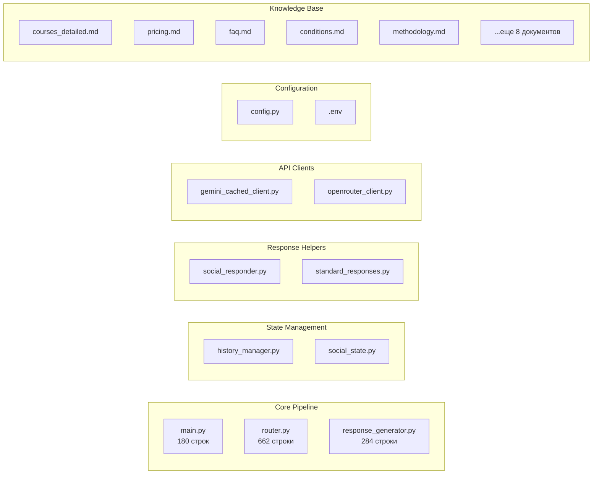
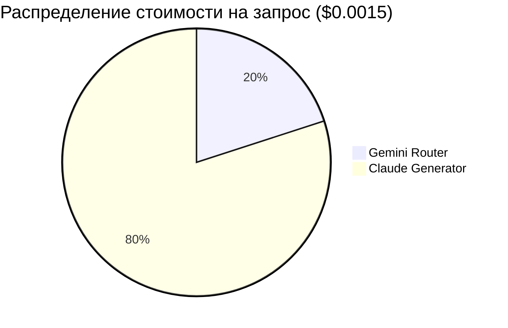
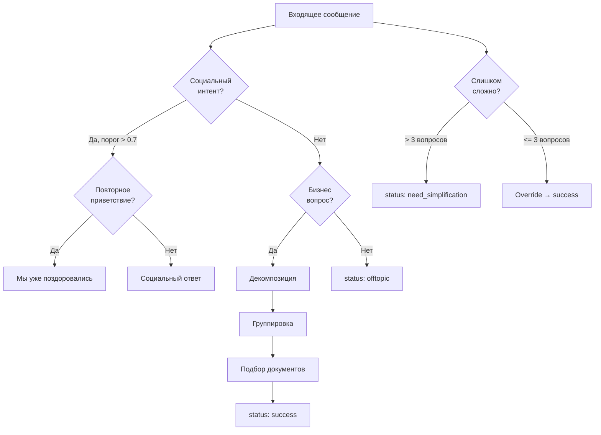

# 🏗️ Архитектура Ukido AI Assistant v0.7.6

## 📊 Полная диаграмма архитектуры

## 🔄 Детальный Flow обработки запроса

## 📁 Структура компонентов

## 💰 Экономическая модель

## 🎯 Классификация запросов

## 🔧 Конфигурационные параметры

| Параметр | Значение | Описание |
|----------|----------|----------|
| HISTORY_LIMIT | 10 | Максимум сообщений в истории |
| TEMPERATURE | 0.7 | Креативность генерации |
| SEED | 42 | Для воспроизводимости |
| SOCIAL_THRESHOLD | 0.7 | Порог для социальных интентов |
| MAX_DOCUMENTS | 4 | Максимум документов для контекста |
| RESPONSE_LENGTH | 100-150 слов | Целевая длина ответа |
| CACHE_TTL | Session | Время жизни кеша Gemini |

## 📊 Метрики производительности

```mermaid
gantt
    title Время обработки запроса (среднее)
    dateFormat X
    axisFormat %s
    
    section Pipeline
    Router (Gemini)      :active, 0, 2s
    Generator (Claude)   :active, 2, 7s
    
    section Быстрый путь
    Social in Router     :done, 0, 0.1s
```

## 🚀 Оптимизации v0.7.6

1. **Удален Quick Regex** - все через Router для консистентности
2. **Кеширование Gemini** - экономия на повторных запросах
3. **In-memory хранилища** - без БД для скорости
4. **Социалка в Router** - экономия вызовов Claude
5. **Ограничение истории** - баланс контекст/стоимость
6. **Группировка вопросов** - оптимальный подбор документов

---
*Диаграмма актуальна для версии 0.7.6 от 17.08.2025*