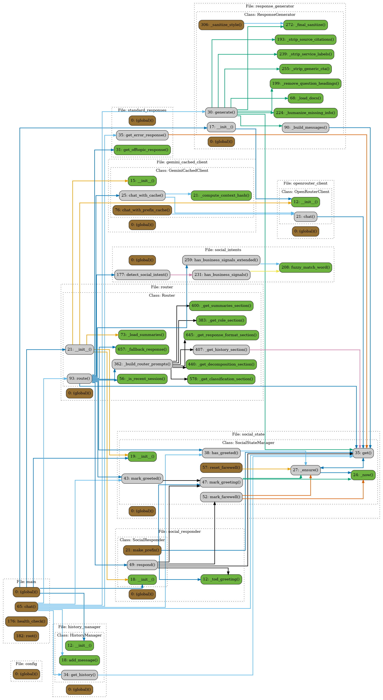

# 🏗️ Ukido Architecture Diagrams

Auto-generated on: $(date)

## 📊 Available Diagrams:

### 1. Dependencies Graph

### 2. Call Flow

### 3. UML Classes

## 🔄 Update Schedule
These diagrams are automatically updated when:
- Python files in `src/` are modified
- This workflow file is updated
- Manually triggered from Actions tab

## 📦 Project Structure
- **Router**: Gemini-based intent classification
- **Generator**: Claude-based response generation
- **History**: Context management (last 10 messages)
- **Social**: Social intent handling
Mon Aug 18 00:15:00 UTC 2025
